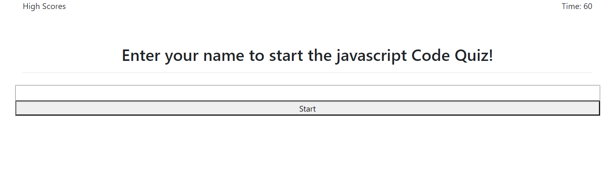
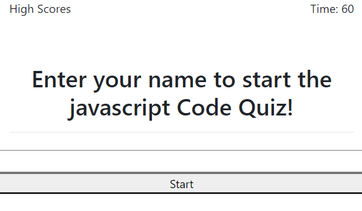
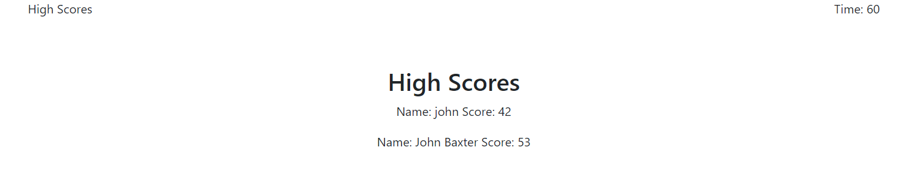

# coding-quiz
A timed coding quiz for javascript.  
This quiz is designed to test your knowledge in javascript with a series of questions.  If you get a question wrong then time will be subtracted.  If you reach 0 time or answer the last question, you will see where you rank on the high score list.  This high score list is saved locally so you can compete against your friends.

## Home Screen

## Responsive Home Screen

## High Score

# Link to deployed
https://jbaxter91.github.io/coding-quiz/
